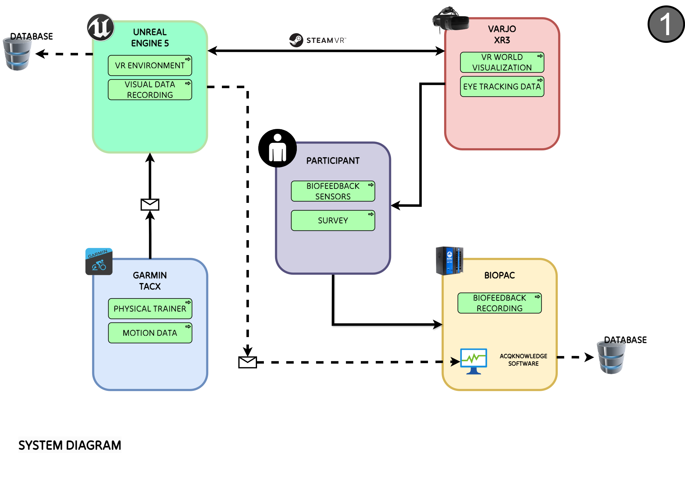
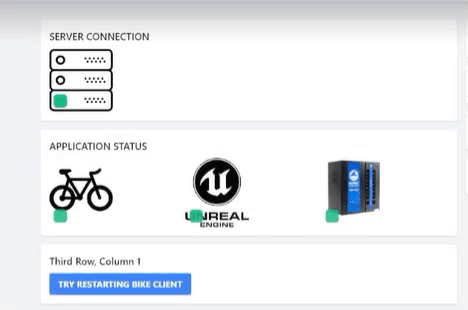

# GREENTRAVELVR
Source code and documentation for the VR environment created for the GREENTRAVEL project

# Network Module

## Overview and Purpose

This module is designed as a part of a larger project consisting of three different modules that communicate with each other:

1. **Unreal Environment**: An urban greenery setting in Unreal Engine 5, experienced via a VR headset, with a digital bicycle controlled by a real bike through a Garmin Cadence sensor.
2. **Garmin Cadence Sensor**: Mounted on a real bike's pedal, it connects via Bluetooth to the system running Unreal and transfers pedaling data to Unreal.
3. **Biopac AcqKnowledge Software**: Records biofeedback data and syncs with the Unreal environment via message markers.
4. **NodeMCU8266 Board**: Can send steering data to Unreal (currently not used but included in the code for future extensions).

There is no direct way to communicate between the Cadence Sensor, Unreal, Biopac, or the NodeMCU8266 board. This module facilitates communication using Websockets.

## Core Features

- Facilitates communication between Unreal, Garmin Cadence Sensor, Biopac, and NodeMCU8266 using Websockets.
- Can be integrated into any Unreal project or any project needing communication with Cadence or Biopac.

## Technical Details
Network module takes care of the communication between different components of the VR system


### Technologies and Libraries Used

- **Node.js**: The server code that relays messages between modules.
- **JavaScript and HTML**: Used for the dashboard application.
- **Bleak Library**: Used for Bluetooth communication with the Garmin Cadence sensor.


#### Bleak Library

Bleak is a GATT client software, capable of connecting to Bluetooth Low Energy devices acting as GATT servers. It is compatible with Python and easy to integrate for cross-platform Bluetooth communication.

- [Bleak GitHub Repository](https://github.com/hbldh/bleak)
- [Bleak Documentation](https://bleak.readthedocs.io/en/latest/)

#### Garmin Cadence Sensor

A Bluetooth-enabled sensor mounted on a bicycle pedal to measure pedaling cadence. It sends data to connected devices, which in this case, is integrated with Unreal Engine for real-time simulation.

- [Garmin Cadence Sensor Information](https://www.garmin.com/en-US/p/641221)

#### Biopac AcqKnowledge and NDT

AcqKnowledge is software used with Biopac’s hardware for data acquisition and analysis. The Network Data Transfer (NDT) library facilitates network-based communication for real-time data acquisition and control.

- [Biopac AcqKnowledge NDT Documentation](https://www.biopac.com/product/network-data-transfer/)
- [Biopac AcqKnowledge Information](https://www.biopac.com/product/acqknowledge/)

##### NOTE 
**biopacndt.py** is biopac module. For this reason, this module is not added in the GitHub (in case one needs to make it public). This module is to be found in Acqknowledge installation directory - "C:\Program Files\BIOPAC Systems, Inc\AcqKnowledge 5.0\Network Data Transfer Examples\Python 3"

### Unreal Integration

A `GTVLNetworkConnectionComponent` component class is included and can be added in the GameMode, with other blueprints referencing it. This class integrates the network communication within Unreal.

### Design Patterns and Architectural Decisions

The module uses a microservices architecture, allowing each component (Unreal, Cadence, Biopac, NodeMCU8266) to operate independently. Websockets facilitate real-time communication between these components, ensuring modularity and scalability.

## Installation and Setup

1. Include this folder in your Unreal project directory (not mandatory).
2. Directory hierarchy:
    ```
    source
    ├── client
    │   └── bike
    │   │   └── BikeDataToServer.py
    │   └── biopac
    │   │   └── ServerToBiopac.py
    │   └── unreal
    │       └── GTVLNetworkConnectionComponent.h
    │       └── GTVLNetworkConnectionComponent.cpp
    ├── dashboard
    │   ├── DashboardIndex.html
    │   └── ConnectionStatus.js
    ├── server
    │   └── server.js
    ```

### Steps to Setup

1. Navigate to the `server` folder.
2. Start the NodeJS server:
    ```sh
    node server
    ```
    if ws is not installed, use:
    ```sh
    npm install ws
    ```
    and try again.
3. Open `DashboardIndex.html` in a web browser. (Dashboard App)
4. Start the AcqKnowledge application (if Biopac is connected. It can be run in analyze only mode without live biopac. It still needs the licence usb drive).
5. Run the Biopac script:
    ```sh
    python ServerToBiopac.py
    ```
    (You will need Websockets and termcolor installations. Run
   ```sh
   pip install websockets
   pip install termcolor 
    ```
   This can be run inside anaconda interface or pure python - any latest version)
7. Revive the Cadence Sensor by rotating the crank two full rotations.
8. Run the Cadence script:
    ```sh
    python BikeDataToServer.py
    ```
9. Open the Unreal Environment.
10. Check the Dashboard page from step 3 to ensure all modules are green.

## Usage

### Basic Usage Example

Use the `MockClient` application to test the server connection. Messages are passed using Websockets in JSON format.

### JSON Message Structure

```json
{
    "type": "ue5", // or "bike" or "server" or "dashboard" or "biopac" or "bikescript"
    "action": "statuscheck", // or "data" or "start" or "restart" or "stop"
    "processstate": "running", // or "already running" or "error" or "not running" or "stopped"
    "pid": <number>, // process id
    "cumulative_crank_revs": <cumulative_crank_revs>,
    "last_crank_event_time": <last_crank_event_time>,
    "message": <any string>,
    "throttle": <value>,
    "steering": <value>
}
```
### Configuration and Options
Modules can run on the same or different machines, provided they are on the same network.
Update the IP address of the server in each script if running on different machines.
**ESP32 Configuration**
(Not part of the current development) - Update the IP address in the ESP32WebSocket.ino code. Refer to the separate configuration document.

### API Endpoints
Biopac AcqKnowledge NDT APIs
Connect to the NDT server on port 15010.
Example API methods:
```python
acqServer = biopacndt.AcqNdtQuickConnect()
acqServer.insertGlobalEvent(event_type, event_id, description)
acqServer.getAcquisitionInProgress()
```
For more details, refer to the Biopac AcqKnowledge NDT Documentation.

### Error Handling and Logging
The Dashboard sends a "statuscheck" message every 10 seconds to the server, which relays it to all modules.
The server prints the number of clients connected and any messages passed between modules in the terminal.
Unreal can print messages on the viewport for debugging for example. The Dashboard page uses this statuscheck responses to show which modules are currently connected to the server.



### Performance Considerations
No noticeable lag in message communication observed.
Potential optimization by shortening the JSON structure.
Consider using UDT protocol for faster communication if needed.

### Contributing and Extending
The module is designed for simplicity and robustness.
Suggestions for extension:
Enhance the Dashboard with more indicators and parameters.
Implement a single-button solution to start all scripts.
Avoid restarting the Cadence script by checking sensor status frequently.
